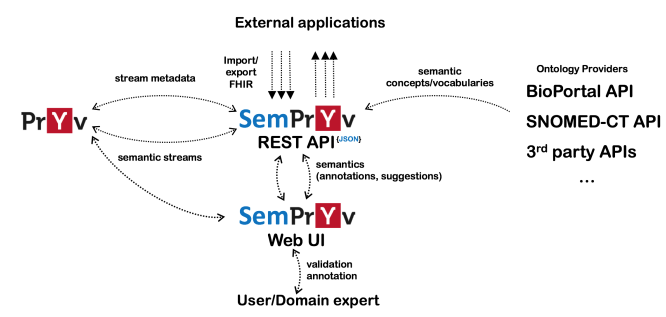
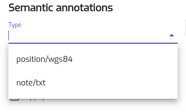
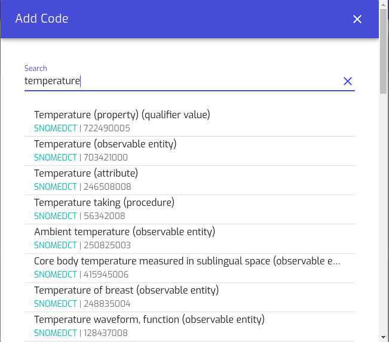
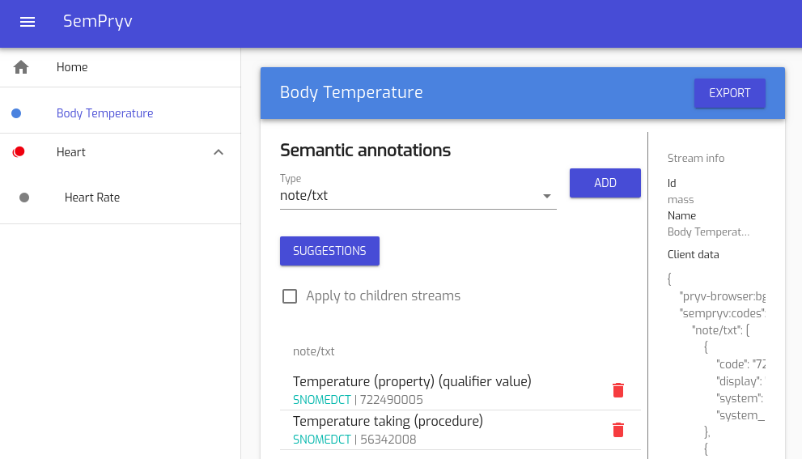

# SemPryv


## Intro 

Pryv.io is a comprehensive solution for managing this particularly sensitive type of data stream, focusing both on data privacy and decentralization. 

SemPryv is a system that provides semantization mechanism for enriching Pryv.io personal data streams with standardized specialized vocabularies from third-party providers. It relies on third providers of semantic concepts, and includes rule-based mechanisms for facilitating the semantization process. This implementation is pluggable to the existing Pryv.io platforms.

## References

This repository contains the code of the SemPryv project, developed by the
[AISLab group](https://www.hevs.ch/en/minisites/projects-products/aislab/) with [Pryv](https://pryv.com).

- [AIS Lab group](https://www.hevs.ch/en/minisites/projects-products/aislab/)
- [hes-so valais/wallis](https://www.hevs.ch/)
- [Pryv](https://pryv.com/)

This development is the result of a research project ["Semi-automatic semantic enrichment of personal data streams"](https://hesso.tind.io/record/5222) published online. 

# Demo 

SemPryv can be tested online at: [https://sempryv.ehealth.hevs.ch/en/auth](https://sempryv.ehealth.hevs.ch/en/auth)

Description & Architecture
==
SemPryv aims to stream data enrichment by providing semantic annotation capabilities on the Pryv.io middleware. 
The semantic annotation process associates high-level ontology concepts to the stream events. It can be done in two ways: 

1. **Manually** by searching well-known ontology providers (such as bioportal), or
2. **Semi-automated** where annotation suggestions are provided to the users. These suggestions are derived by predefined rules that experts can modify and save them in the system’s knowledge graph.
3. **Fully automated** suggestions: They derived by machine learning models that have been trained on synthetic data from mobile apps combined by users existing annotations.

The architecture of SemPryv is depicted in the picture below. SemPryv has two main components, a web <b>User Interface</b> 
for end users and experts and a <b>back end</b> that exposes the core services as a REST API to external applications. 
It also connects to a series of providers for semantic vocabularies and also includes endpoints dedicated for the import/export 
of HL7 FHIR - compliant data streams, represented as bundle collections of observations. Since the annotations are ready, 
streams can be exposed to the Pryv again with all of their metadata.


Figure 1: Sempryv Architecture


## User Interface
Every time a user connects with SemPryv she accesses the hierarchical structure of her streams and the corresponding events. 
The user must first declare the annotation type in the corresponding field and then she can search for a 
semantic annotation into existing ontologies or look for any possible suggestions. A detailed semantization example of 
two streams is described below:
* User accesses her streams and events through login process and providing her authorization token. The data consist of two streams: 
_Body Temperature_ (BT) and _Heart_ (H). Heart has also a child-stream named _Heart Rate_ (HR). BT and H consist of one 
_text/note_ event each, while HR has two events, a note/txt and one with type position/wgs84. Sempryv proposes the already 
declared types that inherits from Pryv events (note/txt and position/wgs84) or users can write the type of the annotation by their own as well (figure 2)


* **Search for annotation**: Given the annotation type “note/txt” the user now can add the actual annotation for the specific 
type by clicking the ADD button in order to search available by the system ontologies and add a semantic code. 
In our example the user searches for an annotation type for “temperature” and a full list of the proposed semantics is provided, 
queried from him (figure 3).

User checks and confirms two of the suggestions: **SNOMEDCT | 722490005** and **SNOMEDCT | 56342008** 
and so the final annotation is depicted in figure 4. The similar is done for the heart and heart rate stream.


  
Figure 2: proposed terms based on stream events  


  
Figure 3: query suggestions

  
Figure 4: Annotated streams


## Semi-automated suggestions
SemPryv includes the possibility of using predefined rules expressed in its knowledge graph. The rules are defined by 
administrators or experts in a json format like this:

```shell
"graph": [{
  "@id": "pryv:bodyTemperature",
  "@type": "skos:Concept",
  "skos:notation": "note/txt",
  "skos:broader": "pryv:temperature",
  "skos:closeMatch": "snomed-ct:386725007"
},
{
  "@id": "pryv:heart",
  "@type": "skos:Concept",
  "skos:notation": "note/txt",
  "skos:closeMatch": "snomed-ct:36407500"
},
{
  "@id": "someRuleSet1",
  "pryv:pathExpression": "body temperature/",
  "pryv:mapping": ["pryv:temperature"]
},
{
  "@id": "someRuleSet2",
  "pryv:pathExpression": "heart/",
  "pryv:mapping": ["pryv:heart"]
}]
```

These rules essentially allow the definition of close terms from different ontologies. We observe that if the kind of annotation type is **note/txt**, the knowledge graph matches Pryv heart streams to a SNOMED-CT code identified as: **snomed-ct:364075005**. Then, the system matches these rules to heart stream path **heart/** and thus provide the final suggestions. 

## Fully automated suggestions and finally annotated data
SemPryv also provides automated suggestions to the users based on a machine learning pipeline. When a user wants to annotate 
a stream, suggestions are provided by pressing the suggestions button. Two predictive models have been trained and they provide 
combined suggestions: 1. A user model which uses the already annotated streams by all users and 2. a synthetic model which has 
been trained on data from two mobile applications.    

Finally, when one makes an API call to get the streams, he gets the structure of her annotated data where the annotations 
have also been saved.


```shell
"annotated_streams": [
  {
    "name": "Body Temperature",
    "created": 1563181161.839,
    "clientData": {
      "sempryv:codes": {
        "note/txt": [
          {
            "system_name": "SNOMEDCT",
            "code": "722490005",
            "display": "Temperature (property) (qualifier value)",
            "system": "http://snomed.info/sct"
          },
          {
            "system_name": "SNOMEDCT",
            "code": "56342008",
            "display": "Temperature taking (procedure)",
            "system": "http://snomed.info/sct"
          },
          {
            "system_name": "SNOMEDCT",
            "code": "386725007",
            "display": "Body temperature (observable entity)",
            "system": "http://snomed.info/sct"
          }
        ]
       },
      "pryv-browser:bgColor": "#3498db",
      "sempryv:recursive": false
    },
    "modified": 1564756907.893,
    "children": [

    ],
    "modifiedBy": "cjxa7szlr00471id30j8dtxpd",
    "createdBy": "cjx3edqz8001k1hd33kitvxb8",
    "parentId": null,
    "id": "mass"
  },
  {
    "name": "Heart",
    "created": 1564496540.827,
    "clientData": {
      "sempryv:codes": {
        "note/txt": [
          {
            "system_name": "SNOMEDCT",
            "code": "467178001",
            "display": "Bedside heart rate monitor (physical object)",
            "system": "http://snomed.info/sct"
          },
          {
            "system_name": "SNOMEDCT",
            "code": "364075005",
            "display": "Heart rate (observable entity)",
            "system": "http://snomed.info/sct"
          }
        ]
      },
      "pryv-browser:bgColor": "#e81034",
      "sempryv:recursive": true
    },
    "modified": 1564741665.221,
    "children": [
      {
        "name": "Heart Rate",
        "created": 1564497209.826,
        "clientData": {
          "sempryv:codes": {
            "note/txt": [
              {
                "system_name": "SNOMEDCT",
                "code": "233916004",
                "display": "Heart block (disorder)",
                "system": "http://snomed.info/sct"
              }
            ]
          },
          "sempryv:recursive": false
        },
        "modified": 1564585383.596,
        "children": [
        ],
        "modifiedBy": "cjxa7szlr00471id30j8dtxpd",
        "createdBy": "cjxa7szlr00471id30j8dtxpd",
        "parentId": "heart",
        "id": "heartRate"
      }
    ],
    "modifiedBy": "cjxa7szlr00471id30j8dtxpd",
    "createdBy": "cjxa7szlr00471id30j8dtxpd",
    "parentId": null,
    "id": "heart"
  }
]
```


# Setup

## Prerequisites

The rest of this documentation is assuming the following prerequisites:

1.  A working and recent linux environment.

2.  A `.env` file in the `backend/` folder containing the following content:

    ```shell
    BIOPORTAL_API_KEY=...
    ```

    The `BIOPORTAL_API_KEY` can be obtained by creating an account on the
    [bioportal website][].

3.  A `.env` file in the `frontend/` folder containing the following content:

    ```shell
    VUE_APP_BACKEND=...
    ```

    The `VUE_APP_BACKEND` should contain the root URL where the backend service
    can be accessed. For instance for development setup it can be set to:
    `http://localhost:8000`.

[bioportal website]: https://bioportal.bioontology.org/account

## Production setup

**Warning:** Building the image the frontend image requires at least 2GB RAM.

To run SemPryv locally in production mode, the following steps are required:

1.  Install `docker` (tested with version `18.05.0-ce`, build `f150324782`)

2.  Ensure the `.env` files exist as described in the
    [requirements](#requirements) section.

3.  Build and deploy the containers with:

    ```shell
    docker-compose up
    ```

If successful, the website should then be accessible at http://localhost.

For a production deployment on a server, the steps are similar, but don't forget
to modify the `docker-compose.yml` file to your need (ports, volumes, …).

## Development setup

For the development setup, two terminals will be needed, one for running the
backend and one for running the frontend. The procedures are described below:

_**Backend**_

1.  Go to the backend directory:

    ```shell
    cd backend
    ```

2.  Create a virtual environment:

    ```shell
    python -m venv venv
    ```

3.  Activate the virtual environment:

    ```shell
    . ./venv/bin/activate
    ```

4.  Install python dependencies for the development:

    ```shell
    pip install -r dev-requirements.txt
    ```

5.  Start the backend development server:

    ```shell
    python -m sempryv
    ```

If successful, you should be able to access a page at http://localhost:8000
returning a `404 Not Found` error.

_**Frontend**_

1.  Go to the frontend directory:

    ```shell
    cd frontend
    ```

2.  Install dependencies with `npm`:

    ```shell
    npm install
    ```

3.  Start the frontend development server:

    ```shell
    npm run serve
    ```

If successful, you should be able to access the website at http://localhost:8080

# Licence

Copyright (c) 2020 Pryv S.A. https://pryv.com & AIS Lab - HES VALAIS/WALLIS https://www.hevs.ch/en/minisites/projects-products/aislab/

This file is part of Open-Pryv.io and released under BSD-Clause-3 License

Redistribution and use in source and binary forms, with or without modification, are permitted provided that the following conditions are met:

Redistributions of source code must retain the above copyright notice, this list of conditions and the following disclaimer.

Redistributions in binary form must reproduce the above copyright notice, this list of conditions and the following disclaimer in the documentation and/or other materials provided with the distribution.

Neither the name of the copyright holder nor the names of its contributors may be used to endorse or promote products derived from this software without specific prior written permission.

THIS SOFTWARE IS PROVIDED BY THE COPYRIGHT HOLDERS AND CONTRIBUTORS "AS IS" AND ANY EXPRESS OR IMPLIED WARRANTIES, INCLUDING, BUT NOT LIMITED TO, THE IMPLIED WARRANTIES OF MERCHANTABILITY AND FITNESS FOR A PARTICULAR PURPOSE ARE DISCLAIMED. IN NO EVENT SHALL THE COPYRIGHT HOLDER OR CONTRIBUTORS BE LIABLE FOR ANY DIRECT, INDIRECT, INCIDENTAL, SPECIAL, EXEMPLARY, OR CONSEQUENTIAL DAMAGES (INCLUDING, BUT NOT LIMITED TO, PROCUREMENT OF SUBSTITUTE GOODS OR SERVICES; LOSS OF USE, DATA, OR PROFITS; OR BUSINESS INTERRUPTION) HOWEVER CAUSED AND ON ANY THEORY OF LIABILITY, WHETHER IN CONTRACT, STRICT LIABILITY, OR TORT (INCLUDING NEGLIGENCE OR OTHERWISE) ARISING IN ANY WAY OUT OF THE USE OF THIS SOFTWARE, EVEN IF ADVISED OF THE POSSIBILITY OF SUCH DAMAGE.

SPDX-License-Identifier: BSD-3-Clause