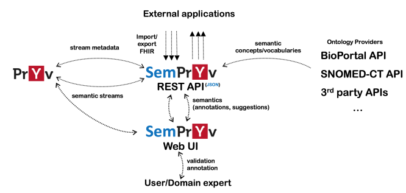
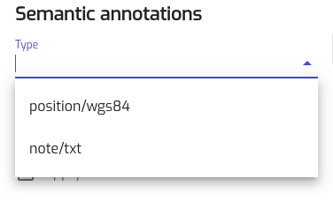
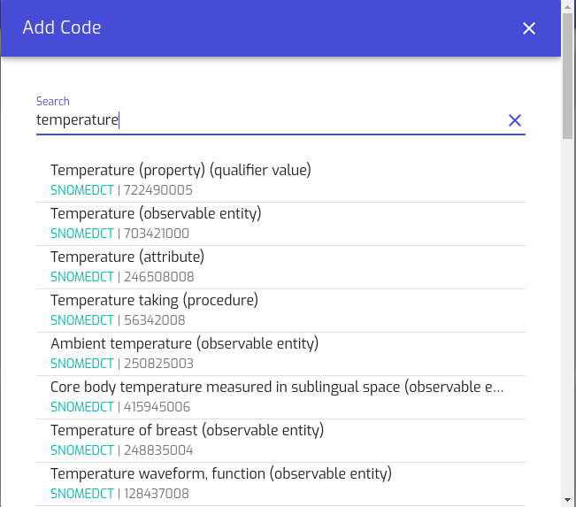
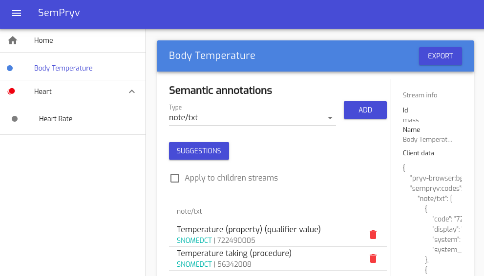

SemPryv documentation for semantization logic
=================
Small Description & Architecture
--
SemPryv aims to stream data encrichment by providing semantic annotation capabilities on the Pryv.io middleware. 
The semantic annotation process associates high-level ontology concepts to the stream events. It can be done by two ways: 
1. **Manually** by searching well-known ontology providers (such as bioportal), or
2. **Semi-automated** where annotation suggestions are provided to the users. These suggestions are derived by predefined rules that experts can modify and save them in system’s knowledge graph.

The architecture of SemPryv is depicted at the picture below. SemPryv has two main components, a web <b>User Interface</b> 
for end-users and experts and a <b>back-end</b> that exposes the core services as a REST API to external applications. 
It also connects to a series of providers for semantic vocabularies and also includes endpoints dedicated for the import/export 
of HL7 FHIR - compliant data streams, represented as bundle collections of observations. Since the annotations are ready, 
streams can be exposed to the Pryv again with all of their metadata.


Figure 1: Sempryv Architecture

## User Interface
Every time a user connects with SemPryv she accesses the hierarchical structure of her streams and the corresponding events. 
The user must first declare the annotation type in the corresponding field and then she can search for a 
semantic annotation into existing ontologies or look for any possible suggestions. A detailed semantization example of 
two streams is described below:
* User accesses her streams and events through login process and providing her authorization token. The data consist of two streams: 
_Body Temperature_ (BT) and _Heart_ (H). Heart has also a child-stream named _Heart Rate_ (HR). BT and H consist of one 
_text/note_ event each, while HR has two events, a note/txt and one with type position/wgs84. Sempryv proposes the already 
declared types that inherits from Pryv events (note/txt and position/wgs84) or users can write the type of the annotation by their own as well (figure 2)


* **Search for annotation**: Given the annotation type “note/txt” the user now can add the actual annotation for the specific 
type by clicking the ADD button in order to search available by the system ontologies and add a semantic code. 
In our example the user searches for an annotation type for “temperature” and a full list of the proposed semantics is provided, 
queried from him (figure 3).

User checks and confirms two of the suggestions: **SNOMEDCT | 722490005** and **SNOMEDCT | 56342008** 
and so the final annotation is depicted in figure 4. The similar is done for the heart and heart rate stream.


  
Figure 2: proposed terms based on stream events  


  
Figure 3: query suggestions

  
Figure 4: Annotated streams


## Semi-automated suggestions and finally annotated data
SemPryv includes the possibility of using predefined rules expressed in its knowledge graph. The rules are defined by 
administrators or experts in a json format like this:

```shell
"graph": [{
  "@id": "pryv:bodyTemperature",
  "@type": "skos:Concept",
  "skos:notation": "note/txt",
  "skos:broader": "pryv:temperature",
  "skos:closeMatch": "snomed-ct:386725007"
},
{
  "@id": "pryv:heart",
  "@type": "skos:Concept",
  "skos:notation": "note/txt",
  "skos:closeMatch": "snomed-ct:36407500"
},
{
  "@id": "someRuleSet1",
  "pryv:pathExpression": "body temperature/",
  "pryv:mapping": ["pryv:temperature"]
},
{
  "@id": "someRuleSet2",
  "pryv:pathExpression": "heart/",
  "pryv:mapping": ["pryv:heart"]
}]
```

These rules essentially allow the definition of close terms from different ontologies. We observe that if the kind of annotation type is **note/txt**, the knowledge graph matches Pryv heart streams to a SNOMED-CT code identified as: **snomed-ct:364075005**. Then, the system matches these rules to heart stream path **heart/** and thus provide the final suggestions 

Finally, when one makes an API call to get the streams, he gets the structure of her annotated data where the annotations 
have also been saved


```shell
"annotated_streams": [
  {
    "name": "Body Temperature",
    "created": 1563181161.839,
    "clientData": {
      "sempryv:codes": {
        "note/txt": [
          {
            "system_name": "SNOMEDCT",
            "code": "722490005",
            "display": "Temperature (property) (qualifier value)",
            "system": "http://snomed.info/sct"
          },
          {
            "system_name": "SNOMEDCT",
            "code": "56342008",
            "display": "Temperature taking (procedure)",
            "system": "http://snomed.info/sct"
          },
          {
            "system_name": "SNOMEDCT",
            "code": "386725007",
            "display": "Body temperature (observable entity)",
            "system": "http://snomed.info/sct"
          }
        ]
       },
      "pryv-browser:bgColor": "#3498db",
      "sempryv:recursive": false
    },
    "modified": 1564756907.893,
    "children": [

    ],
    "modifiedBy": "cjxa7szlr00471id30j8dtxpd",
    "createdBy": "cjx3edqz8001k1hd33kitvxb8",
    "parentId": null,
    "id": "mass"
  },
  {
    "name": "Heart",
    "created": 1564496540.827,
    "clientData": {
      "sempryv:codes": {
        "note/txt": [
          {
            "system_name": "SNOMEDCT",
            "code": "467178001",
            "display": "Bedside heart rate monitor (physical object)",
            "system": "http://snomed.info/sct"
          },
          {
            "system_name": "SNOMEDCT",
            "code": "364075005",
            "display": "Heart rate (observable entity)",
            "system": "http://snomed.info/sct"
          }
        ]
      },
      "pryv-browser:bgColor": "#e81034",
      "sempryv:recursive": true
    },
    "modified": 1564741665.221,
    "children": [
      {
        "name": "Heart Rate",
        "created": 1564497209.826,
        "clientData": {
          "sempryv:codes": {
            "note/txt": [
              {
                "system_name": "SNOMEDCT",
                "code": "233916004",
                "display": "Heart block (disorder)",
                "system": "http://snomed.info/sct"
              }
            ]
          },
          "sempryv:recursive": false
        },
        "modified": 1564585383.596,
        "children": [
        ],
        "modifiedBy": "cjxa7szlr00471id30j8dtxpd",
        "createdBy": "cjxa7szlr00471id30j8dtxpd",
        "parentId": "heart",
        "id": "heartRate"
      }
    ],
    "modifiedBy": "cjxa7szlr00471id30j8dtxpd",
    "createdBy": "cjxa7szlr00471id30j8dtxpd",
    "parentId": null,
    "id": "heart"
  }
]
```

